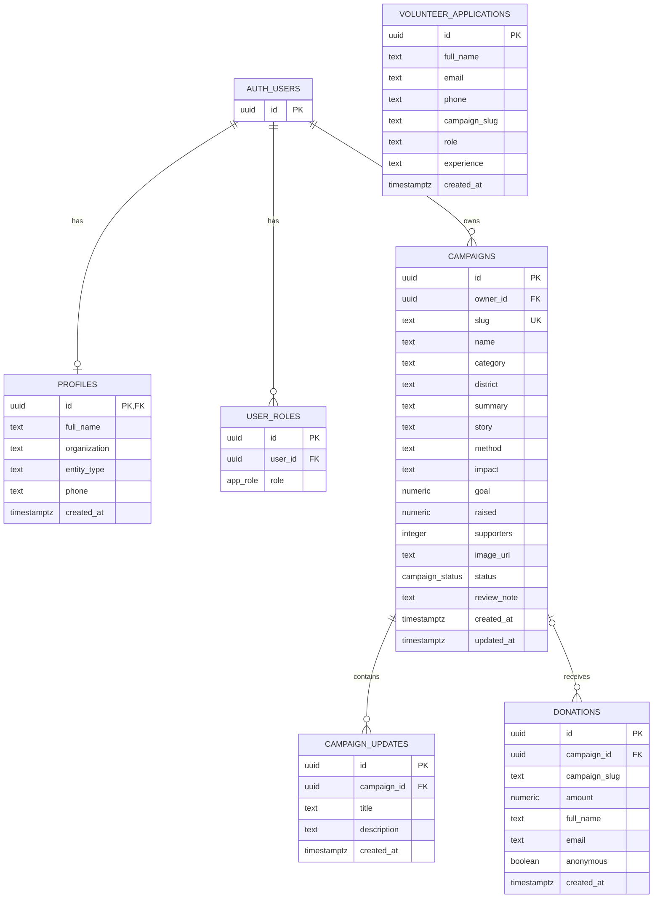

# Thiết kế cơ sở dữ liệu

Sơ đồ dưới đây bao gồm thay đổi dự kiến sau migration `0002_three_roles.sql`; chưa xác nhận đã áp dụng lên DB thật.

Nguồn: `code/backend/drizzle/migrations/0000_roles_and_campaigns.sql` và `0001_admins_read_profiles.sql`. Sơ đồ phản ánh migration trong source, chưa xác nhận schema đang triển khai. `drizzle/schema.ts` hiện trống.

## Ràng buộc

- `auth.users` thuộc Supabase Auth; sơ đồ chỉ mô tả khóa tham chiếu.
- Sau migration `0002_three_roles.sql`, role gồm `admin`, `partner`, `contributor`; cặp `(user_id, role)` vẫn unique. `farmer` cũ được đổi thành `partner` mà không mất quan hệ dữ liệu.
- `profiles.entity_type`: `farmer`, `cooperative`, `enterprise`, hoặc null với người đóng góp/tài khoản cũ chưa xác nhận. Đây là loại chủ thể, không dùng để cấp quyền.
- `campaigns.slug` unique; trạng thái: `cho_duyet`, `can_bo_sung`, `dang_gay_quy`, `hoan_thanh`, `tu_choi`.
- Xóa user cascade hồ sơ, role, chiến dịch; xóa chiến dịch cascade cập nhật, đặt `donations.campaign_id` thành null.
- `volunteer_applications.campaign_slug` và `donations.campaign_slug` là text, chưa có FK. Không vẽ quan hệ FK cho đăng ký chuyên môn.
- Trigger tạo profile và role `contributor` mặc định, hoặc `partner` khi đăng ký hợp lệ; metadata không được tự cấp `admin`. `has_role` đọc quyền từ bảng `user_roles`.

## RLS và điểm cần hoàn thiện

Các bảng public ở trên bật RLS. Khách đọc chiến dịch/cập nhật đã công khai và gửi đóng góp/đăng ký; chủ chiến dịch đọc dữ liệu của mình; admin đọc dữ liệu quản trị theo policy.

Migration 0002 yêu cầu role partner khi nộp hồ sơ/đăng tiến độ và giới hạn sửa hồ sơ ở trạng thái chờ/bổ sung. Vẫn cần siết quyền sửa từng cột như raised/supporters trước pilot. Chưa có bảng thanh toán, chỉ số tác động hoặc xử lý liên hệ.

Migration 0002 chưa chạy trên DB thật. Áp dụng sau 0000/0001 và commit trước khi cho phép đăng ký contributor. Không sinh migration từ schema Drizzle trống; không chỉnh sửa các migration lịch sử. Bản source ứng dụng mới cần DB đã áp dụng 0002.
